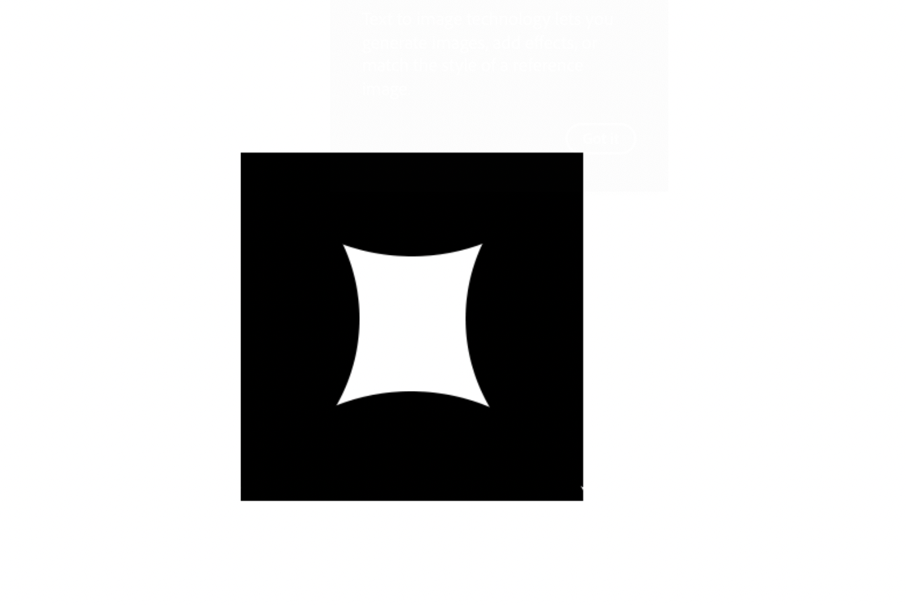
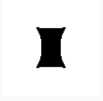
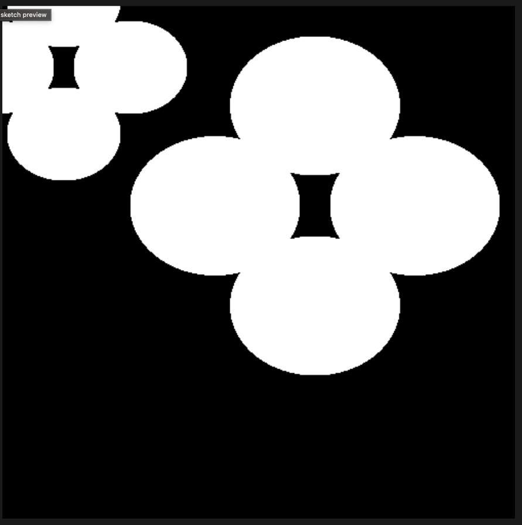
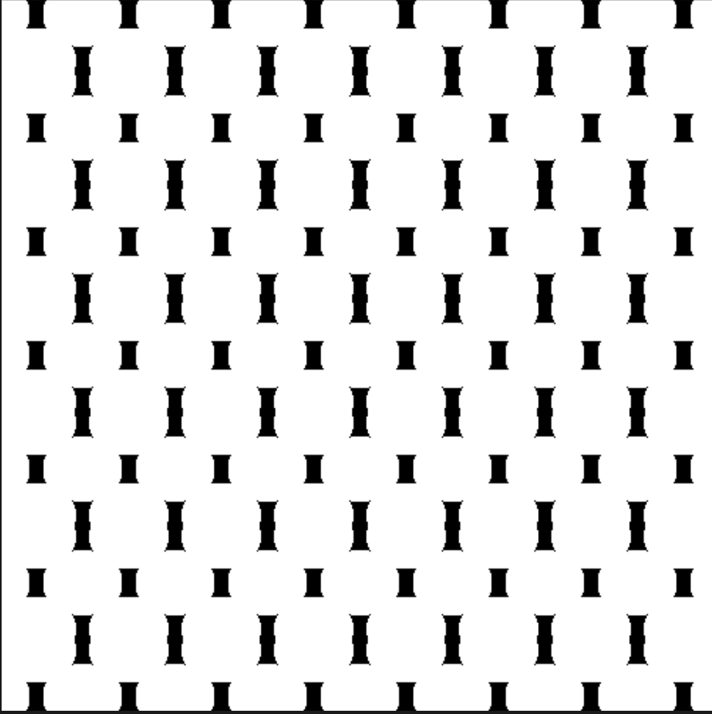

# MidTerm Project

### Phase 1: Creating the basic motif in photoshop

- The shape is composed by the free space between four cyrcles with them being cut by 4 quads. Like this:

### Phase 2: Creating it on p5

-  So one important detail for my shape is that it is composed by 4 cyrcles which can be cut by one other shape on photoshop but in p5 its not to easy, so for simplisitys sake ill keep the shape with the cyrcles not cut as the space in between is what matters planning to mask the circles by overlapping them at the tiling stage. 
  

- Got the coordinates of the ellipse right. p

- coloring it :

`function setup() {
  createCanvas(100,100);
  background(255);
  let c = color(100, 0 ,0)
  fill(c);
  noStroke();
  ellipse(50, 0,100,100)
  }`

- After some learning and configuration I got this:

`function setup() {
  createCanvas(100,100);
  background(255);
}
function myShape(x, y){
  let c = color(100, 0 ,0)
  fill(c);
  noStroke();
  ellipse(x, y, 110, 90, 50)// I used 4 variables as I was trying to improve the quality using vertices
}
function draw(){
  myShape(-15, 50)
  myShape(50, -15)
  myShape(115, 50)
  myShape(50, 115)
}`

 Which got me the correct shape:
 

  
- I expirimented with some different colors finlly going with the inverted version of phase 1

- The let c = color.. line was unnecessary after I decided on using black and white. 

### Phase 3:

- Beacuse of my shapes special form, its borders up until the last phase have to be imagined. The new function created worked fine

`
function setup(){
  createCanvas(500, 500);
  background(0);
  noStroke();
}
function drawObject(x, y, s){≠≠
  push()
  translate(x, y);
  scale(s);
  fill(255);
  ellipse(-15, 50, 110, 90, 50);
  ellipse(50, -15, 110, 90, 50);
  ellipse(115, 50, 110, 90, 50);
  ellipse(50, 115, 110, 90, 50);
  pop()
}
function draw(){
  drawObject(0, 0);
  drawObject(230, 120, 1.5);
}`

- I just wondered for a bit if I could have "binded" my code for the whole shape so i could treat it as a whole, but beacuse it had to have the draw() function in every time i tried calling it later it didnt work.

- Know I can manipulate the location and size:

### Phase 4: Tiling 

- So granted my shape has imaginary borders, there wasnt a realistic and practical use of size in relation to my canvas size but I found it to be just an aesthetic issue. I understood however if having another shape how I should be maniuplating it to spread evenly across the canvas. 

`function setup(){
  createCanvas(500, 500);
  background(0);
  noStroke();
}
function drawObject(x, y, s){
  push()
  translate(x, y);
  scale(s);
  fill(255);
  ellipse(-15, 50, 110, 90, 50);
  ellipse(50, -15, 110, 90, 50);
  ellipse(115, 50, 110, 90, 50);
  ellipse(50, 115, 110, 90, 50);
  pop()
}
  function draw(){
 for (y = -15; y < 500; y += 80)
 for (x = 0; x < 500; x += 65)
   drawObject(x,y, 0.5)
  }`
  
  

## Problems faced:

- thinking about creating one function for the ellipse and then nesting it to create four duplicates one for each side. Im going to try doing this by using the translate() a
function. Found out rotate() so going to use that instead. 

 `function semiC() {
  createCanvas(100,100);
  background(255);
  let c = color(100, 0 ,0)
  fill(c);
  noStroke();
  ellipse(50, 0,100,100)
  }
function myShape(){
  angleMode(DEGREES)
  rotate(0)
  draw(semiC)
}`

- Didnt work, probably using the draw() funtcion wrong. 

- For phase 4 there was an allingment issue, so I just manipulated the x variable of my starting position and that fixed it. 

- I also tried downloading the .js file from the p5 website but didnt work, so I copied and pasted the code in a .md file and renamed it .js. I did not remeber if that was how we were supposed to do it. 
 